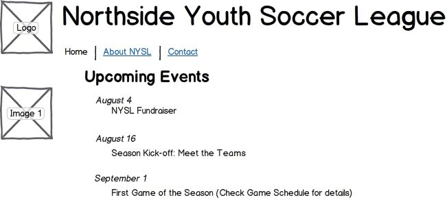
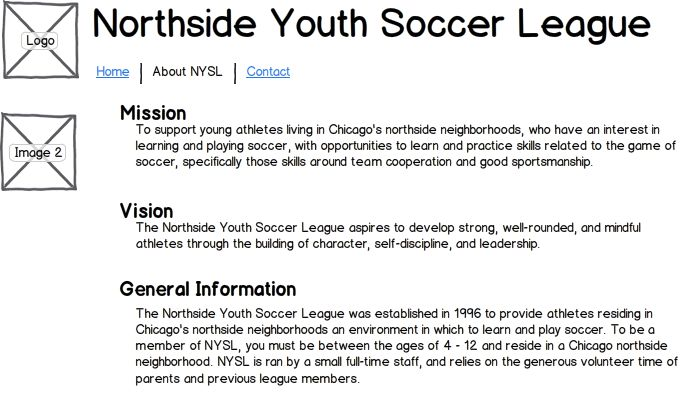
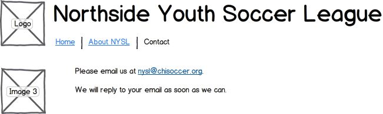
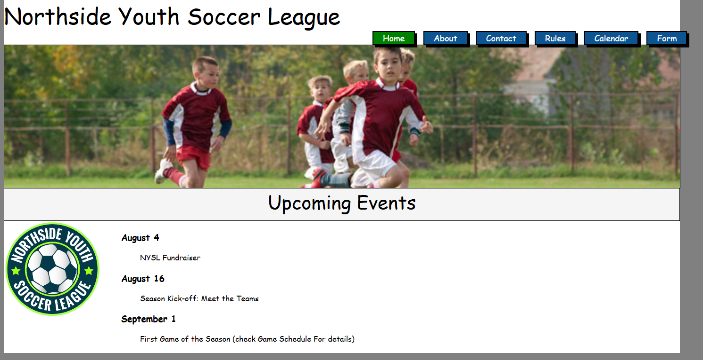
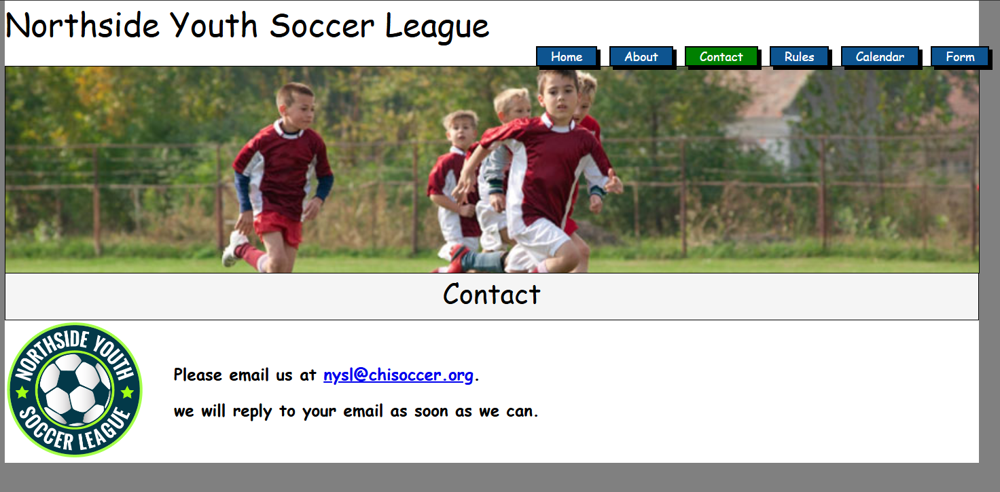
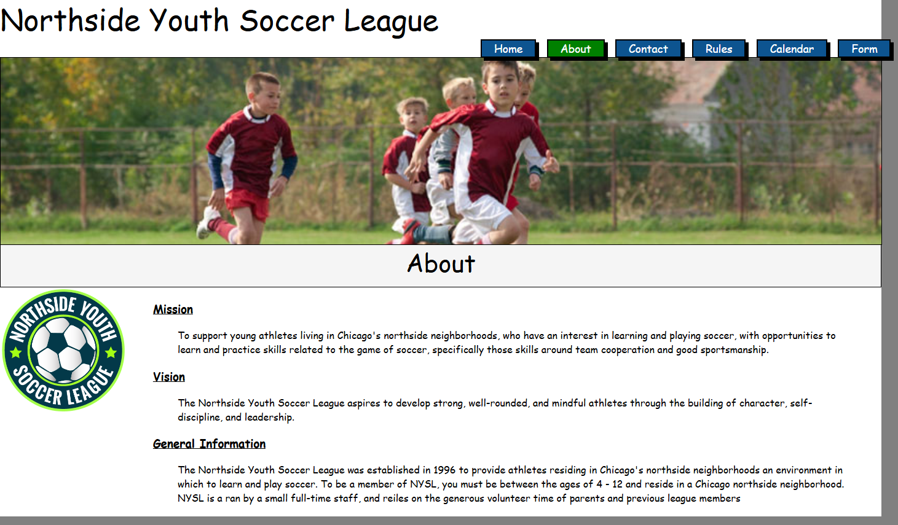

# Northside Youth Soccer League Website

Este es el repositorio del sitio web desarrollado como parte de un proyecto académico del curso de **Programación Front-End** implementado por **Talento Digital** en el año 2020. El sitio web fue solicitado por el tutor del curso como ejercicio práctico para aplicar los conocimientos adquiridos en HTML, CSS y JavaScript, siendo este la primera evaluacion del curso

---

## Descripción

El objetivo del proyecto fue crear un sitio web funcional que representara a la **Northside Youth Soccer League**, proporcionando información clave sobre la liga a jugadores, padres y entrenadores. El proyecto enfatiza las mejores prácticas de desarrollo Front-End y está diseñado para ser sencillo, funcional y completamente estático.

El sitio está alojado en **GitHub Pages**, permitiendo un acceso fácil y gratuito.

---

## Características

### Estructura del Sitio
El sitio cuenta con las siguientes secciones/páginas:
1. **Inicio**: Información básica sobre la liga.
2. **Equipos y Entrenadores**: Detalles de los equipos y entrenadores.
3. **Calendario**: Eventos y horarios de partidos.
4. **Noticias**: Actualizaciones importantes para la liga.
5. **Archivos Adjuntos**: Descarga de documentos adicionales.

### Tecnologías Utilizadas
- **HTML5**: Estructura y contenido.
- **CSS3**: Estilos y diseño del sitio.
- **JavaScript**: Funcionalidad e interactividad básica.

### Diseño 
El sitio está diseñado para ser visible solo en navegadores

### Imágenes y Logotipo
- Se incluye el logotipo oficial ficticio de la liga.
- Varias imágenes relacionadas con el tema del fútbol y eventos deportivos han sido añadidas para enriquecer el diseño.

---

## Instalación y Uso

Puedes clonar este repositorio para ejecutarlo localmente o simplemente visitar el sitio web alojado en **GitHub Pages**.

### Clonar el Repositorio
```bash
git clone https://github.com/Carlosvleon/NYSL_desarrollo_html.git
cd NYSL_desarrollo_html
```

### Abrir Localmente
Una vez clonado, abre el archivo `index.html` en tu navegador favorito para visualizar el sitio.

### Visitar en GitHub Pages
[Haz clic aquí para visitar el sitio en GitHub Pages](https://carlosvleon.github.io/NYSL_desarrollo_html/)

---

## Sketch del Diseño de la Página

A continuación, se muestra el boceto original proporcionado como referencia para el desarrollo de la página:

### Página de Home


### Página de About


### Página de Contact


---

## Capturas del Sitio Final

### Página de Inicio


### Sección de About


### Sección de Contacto


## Contacto

Para consultas o sugerencias relacionadas con este proyecto, puedes contactar a:

- **Nombre del Autor:** Carlos Vallejos
- **Correo Electrónico:** [vallejos.leon.carlos@gmail.com]  
- **Curso:** Programación Front-End - Talento Digital (2023)  

